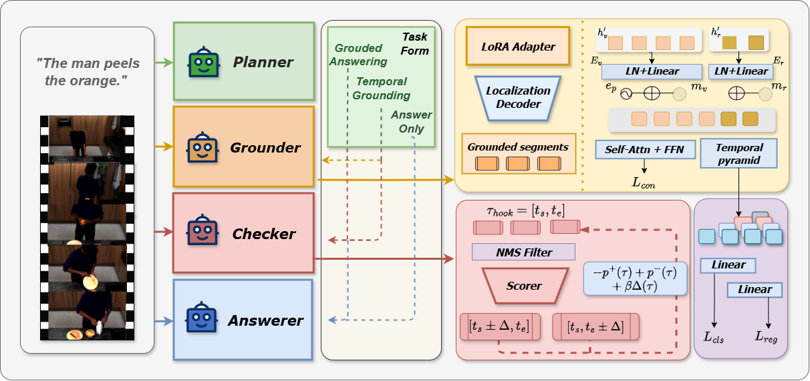

# 🎬 UFMA

UFMA is a temporal video understanding and automatic evaluation project built around a unified `ufma/` codebase. This repository brings training, inference, and evaluation workflows together in one place, with the optimized automatic inference pipeline already integrated into `ufma/eval/infer_auto.py`.



## ✨ Highlights

- 🧩 Unified project layout for training, inference, and evaluation
- ⚡ Optimized automatic inference pipeline with checker ranking and refinement logic
- 🤖 Support for both `Qwen2-VL` and `Qwen2.5-VL`
- 📦 Ready-to-run script sets for pretraining, finetuning, and evaluation
- 🛠️ Dedicated `Qwen2.5-VL-3B` script support

## 📁 Repository Layout

```text
UFMA/
|-- assets/                  # Figures used in the documentation
|-- scripts/
|   |-- evaluation/          # Evaluation entry scripts
|   |-- finetune/            # Finetuning scripts
|   `-- pretrain/            # Pretraining scripts
|-- ufma/
|   |-- dataset/             # Dataset wrappers and utilities
|   |-- eval/                # Inference and evaluation logic
|   |-- model/               # Model definitions and builders
|   |-- train/               # Training entrypoints
|   `-- utils/               # Shared utilities
|-- requirements.txt
|-- setup.cfg
`-- LICENSE
```

## 🚀 Installation

Install the dependencies:

```bash
pip install -r requirements.txt
```

`Qwen2.5-VL` support depends on the `transformers==4.50.0` version pinned in `requirements.txt`.

Recommended environment setup:

```bash
export PYTHONPATH="./:$PYTHONPATH"
```

For Windows PowerShell:

```powershell
$env:PYTHONPATH = ".;$env:PYTHONPATH"
```

## 🧪 Inference & Evaluation

Run automatic inference directly:

```bash
python ufma/eval/infer_auto.py \
  --dataset <dataset_name> \
  --split test \
  --pred_path outputs/<run_name> \
  --model_gnd_path <grounder_model_dir> \
  --model_checker_path <checker_model_dir> \
  --model_pla_path <planner_model_dir>
```

You can also use the provided evaluation scripts:

```bash
bash scripts/evaluation/eval_auto_7b.sh <dataset_name> test
bash scripts/evaluation/eval_auto_2b.sh <dataset_name> test
bash scripts/evaluation/eval_auto_25_3b.sh <dataset_name> test
```

The optimized `infer_auto.py` pipeline supports a set of control arguments for checker-stage ranking, uncertainty estimation, and coordinate descent refinement, including:

- `--checker_topk`
- `--obj_lambda`
- `--obj_beta`
- `--cd_rounds`
- `--cd_step_ratio`
- `--cd_min_step`
- `--uncert_margin_thr`
- `--uncert_disagree_thr`
- `--active_dense_ratio`

## 🏋️ Training

Example pretraining entrypoints:

```bash
bash scripts/pretrain/pretrain_grounder_2b.sh
bash scripts/pretrain/pretrain_planner_2b.sh
bash scripts/pretrain/pretrain_checker_2b.sh
bash scripts/pretrain/pretrain_grounder_25_3b.sh
bash scripts/pretrain/pretrain_planner_25_3b.sh
bash scripts/pretrain/pretrain_checker_25_3b.sh
```

Example finetuning scripts:

```bash
bash scripts/finetune/finetune_qvhighlights_2b.sh
bash scripts/finetune/finetune_qvhighlights_7b.sh
bash scripts/finetune/finetune_qvhighlights_25_3b.sh
```

## 📌 Notes

- 📜 The repository license is provided in `LICENSE`
- 🔁 The project retains the original BSD license while incorporating substantial modifications
- 🙌 The codebase is built on top of VideoMind

## 🙏 Acknowledgement

Thanks to VideoMind for providing the high-quality base code.
